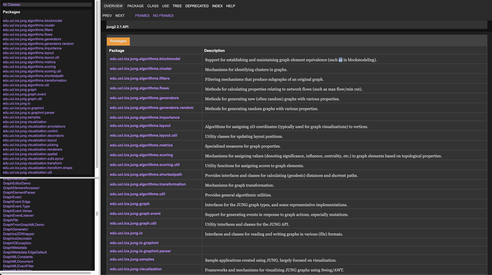

# javadoc-darkmode-stylesheet

The plugin [stylus](https://add0n.com/stylus.html) allows you to insert custom css for pages. The included css file is a "darkmode" coded quickly to hel[ be a bit more readable and eye-freindly. 

  

